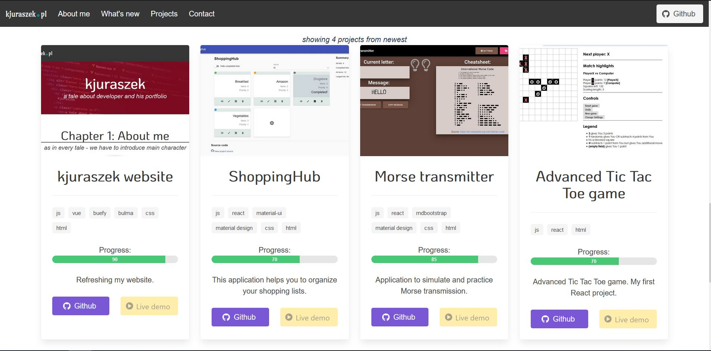

# kjuraszek-website

This is a source code of my website [kjuraszek.pl](https://kjuraszek.pl/).

## Running this project locally

### Clone this project

#### `git clone https://github.com/kjuraszek/kjuraszek-website`

### Install php dependencies using composer

#### `composer install`

### Prepare .env file

- copy `.env.example` file and rename it to `.env`
- update database config (DB_* fields)

### Generate application key

#### `php artisan key:generate`

### Install js dependencies and compile js/css

#### `npm install && npm run dev`

### Serve application

#### `php artisan serve`

Application by default runs on [http://127.0.0.1:8000](http://127.0.0.1:8000).
